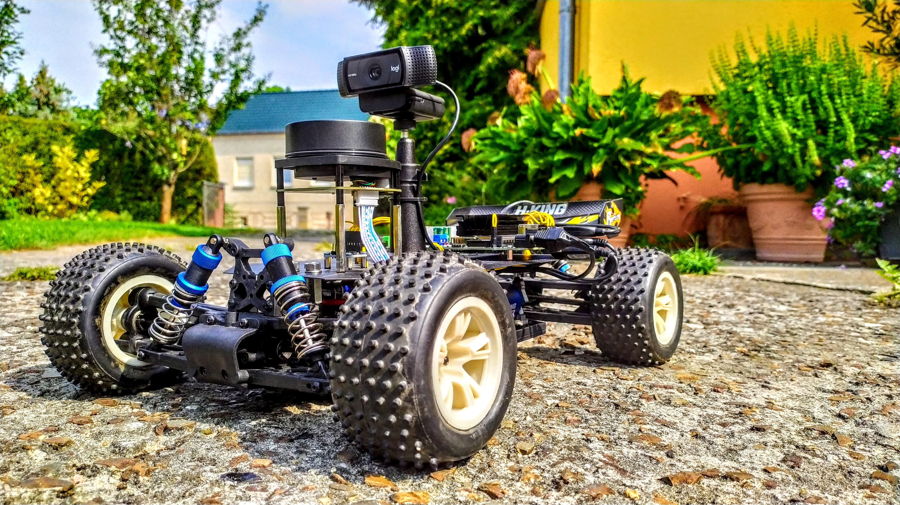

# yoshicar
Software for a self-driving robocar using ROS

# TODO

1. setup IMU
2. setup ros with python 3 correctly
3. setup static IP address
4. implement VESC
   1. automated speed measuring tool:
      1. use webcam to track lines recognized with opencv
      2. program takes distance between lines as input
      3. store (time, distance, motor value)
      4. stop vehicle after intersecting the last line and drive backwards to the first line
      5. repeat process with different speed
   2. figure out steering angle
      1. put car against wall
      2. use LIDAR to measure distance
5. navigation stack:
   1. setup tf
   2. move_base:
      1. plugin teb_local_planner
   
# Notes

## ESC

The ESC is a little weird because it has two backword drive modes.
When using equal power, the car drives faster in backwards than in forwards.
This can be overcome by hitting neutral very quickly after going backwards and then going backwards again.
So it looks like:

backwards -> neutral -> backwards

Then the car drives considerably slower backwards.